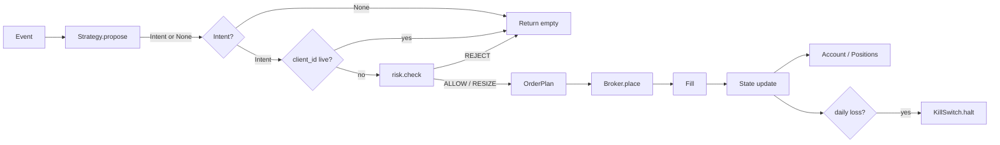

# Architecture

execution-core routes each market event through a linear pipeline: strategy intent, risk gate, broker execution, and state update.

## Pipeline



ASCII equivalent:

```
Event
  │
  ▼
Strategy.propose(event, ctx) ──► Intent | None
  │
  ▼
OrderStore (client_id idempotency)
  │
  ▼
risk.check(intent, account, positions, …) ──► OrderPlan
  │
  ▼
Broker.place(plan) ──► Order / Fill
  │
  ▼
apply_fill_to_account ──► Account, Positions
  │
  ▼
KillSwitch (daily loss threshold)
```

## Idempotency

Each `Intent` carries a required `client_id`. The engine's order store treats a `client_id` as consumed once a non-rejected order is placed for it. If the same `client_id` appears again while the store considers it live, the event is skipped and no second order is sent. This prevents duplicate placement when strategies re-emit the same signal or events are replayed.

The paper broker applies the same rule for live orders at the broker layer. Together, store and broker provide defense in depth without requiring venue-specific idempotency keys.

## Kill switch

The kill switch is a shared halt flag checked at the start of every `on_event` call. When halted—manually via `Engine.halt(reason)` or automatically when `daily_pnl` breaches `max_daily_loss`—the engine cancels open orders and returns no new fills. Strategies still run, but no orders pass through risk or the broker until the process is restarted with a fresh engine or an external reset of the switch.

Automatic halts use reason `"daily_loss"`. Manual halts carry the caller-supplied reason string for logging and operations.
